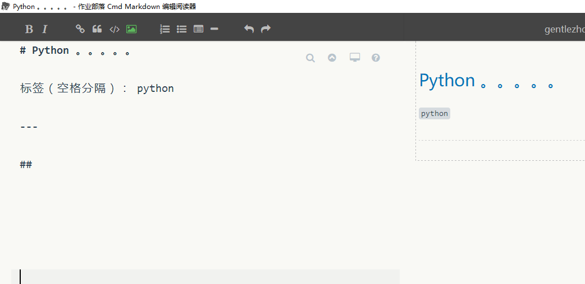

## 面试题27：二叉搜索树与双向链表

题目：如下图，输入一棵二叉搜索树，将该二叉搜索树转换成一个排序的双向链表。要求不能创建任何新的结点，只能调整树中结点指针的指向。



思路：
在二叉树中，每个结点都有两个指向子结点的指针。在双向链表中，每个结点也有两个指针，它们分别指向前一个结点和后一个结点。由于这两种结点的结构相似，同时二叉搜索树也是一种排序的数据结构，因此在理论上有可能实现二叉搜索树和排序的双向链表的转换。在搜索二叉树中，左子结点的值总是小于父结点的值，右子结点的值总是大于父结点的值。因此我们在转换成排序双向链表时，原先指向左子结点的指针调整为链表中指向前一个结点的指针，原先指向右子结点的指针调整为链表中指向后一个结点指针。接下来我们考虑该如何转换。

由于要求转换之后的链表是排好序的，我们可以中序遍历树中的每一个结点， 这是因为中序遍历算法的特点是按照从小到大的顺序遍历二叉树的每一个结点。当遍历到根结点的时候，我们把树看成三部分：值为10 的结点、根结点值为6 的左子树、根结点值为1 4 的右子树。根据排序链表的定义，值为10 的结点将和它的左子树的最大一个结点（即值为8 的结点）链接起来，同时它还将和右子树最小的结点（即值为12 的结点）链接起来.


按照中序遍历的顺序， 当我们遍历转换到根结点（值为10 的结点）时，它的左子树已经转换成一个排序的链表了， 并且处在链表中的最后一个结点是当前值最大的结点。我们把值为8 的结点和根结点链接起来，此时链表中的最后一个结点就是10 了。接着我们去地历转换右子树， 并把根结点和右子树中最小的结点链接起来。至于怎么去转换它的左子树和右子树，由于遍历和转换过程是一样的，我们很自然地想到可以用递归。


```java
/**
 *
 * @param pRootOfTree 二叉树的根节点
 * @return 双向链表的头结点
 */
public TreeNode Convert(TreeNode pRootOfTree) {

    //用于保存处理过程中的双向链表的尾节点
    TreeNode[] lastNode = new TreeNode[1];
    convertNode(pRootOfTree, lastNode);


    // 找到双向链表的头结点
    TreeNode head = lastNode[0];
    while (head != null && head.left != null) {
        head = head.left;
    }
    return head;
}


/**
 *  @param node 当前的根节点
 * @param lastNode 已经处理好的双向链表的尾节点,使用一个  长度为1的数组，类似C++中的二级指针
 */
private void convertNode(TreeNode node, TreeNode[] lastNode) {
    //节点不等于null
    if (node!=null){

        //如果有左子树就先处理左子树
        if (node.left != null) {
            convertNode(node.left, lastNode);
        }

        //将当前结点的前驱指向已经处理好的双向链表（由当前结点的左子树构成）的尾结点
        node.left = lastNode[0];

        // 如果左子树转换成的双向链表不为空，设置尾结点的后继
        if (lastNode[0] != null) {
            lastNode[0].right = node;
        }

        // 记录当前结点为尾结点
        lastNode[0] = node;

        // 处理右子树
        if (node.right != null) {
            convertNode(node.right, lastNode);
        }
    }
}
```

在这里放出牛客某位大神的三种解法：


方法一：非递归版
解题思路：
1.核心是中序遍历的非递归算法。
2.修改当前遍历节点与前一遍历节点的指针指向。
```java
import java.util.Stack;
public TreeNode ConvertBSTToBiList(TreeNode root) {
    if(root==null)
        return null;
    Stack<TreeNode> stack = new Stack<TreeNode>();
    TreeNode p = root;
    TreeNode pre = null;// 用于保存中序遍历序列的上一节点
    boolean isFirst = true;
    while(p!=null||!stack.isEmpty()){
        while(p!=null){
            stack.push(p);
            p = p.left;
        }
        p = stack.pop();
        if(isFirst){
            root = p;// 将中序遍历序列中的第一个节点记为root
            pre = root;
            isFirst = false;
        }else{
            pre.right = p;
            p.left = pre;
            pre = p;
        }      
        p = p.right;
    }
    return root;
}
```
方法二：递归版
解题思路：
1.将左子树构造成双链表，并返回链表头节点。
2.定位至左子树双链表最后一个节点。
3.如果左子树链表不为空的话，将当前root追加到左子树链表。
4.将右子树构造成双链表，并返回链表头节点。
5.如果右子树链表不为空的话，将该链表追加到root节点之后。
6.根据左子树链表是否为空确定返回的节点。
```java
public TreeNode Convert(TreeNode root) {
    if(root==null)
        return null;
    if(root.left==null&&root.right==null)
        return root;
    // 1.将左子树构造成双链表，并返回链表头节点
    TreeNode left = Convert(root.left);
    TreeNode p = left;
    // 2.定位至左子树双链表最后一个节点
    while(p!=null&&p.right!=null){
        p = p.right;
    }
    // 3.如果左子树链表不为空的话，将当前root追加到左子树链表
    if(left!=null){
        p.right = root;
        root.left = p;
    }
    // 4.将右子树构造成双链表，并返回链表头节点
    TreeNode right = Convert(root.right);
    // 5.如果右子树链表不为空的话，将该链表追加到root节点之后
    if(right!=null){
        right.left = root;
        root.right = right;
    }
    return left!=null?left:root;       
}
```


方法三：改进递归版
解题思路：
思路与方法二中的递归版一致，仅对第2点中的定位作了修改，新增一个全局变量记录左子树的最后一个节点。
```java
// 记录子树链表的最后一个节点，终结点只可能为只含左子树的非叶节点与叶节点
protected TreeNode leftLast = null;
public TreeNode Convert(TreeNode root) {
    if(root==null)
        return null;
    if(root.left==null&&root.right==null){
        leftLast = root;// 最后的一个节点可能为最右侧的叶节点
        return root;
    }
    // 1.将左子树构造成双链表，并返回链表头节点
    TreeNode left = Convert(root.left);
    // 3.如果左子树链表不为空的话，将当前root追加到左子树链表
    if(left!=null){
        leftLast.right = root;
        root.left = leftLast;
    }
    leftLast = root;// 当根节点只含左子树时，则该根节点为最后一个节点
    // 4.将右子树构造成双链表，并返回链表头节点
    TreeNode right = Convert(root.right);
    // 5.如果右子树链表不为空的话，将该链表追加到root节点之后
    if(right!=null){
        right.left = root;
        root.right = right;
    }
    return left!=null?left:root;       
}
```


