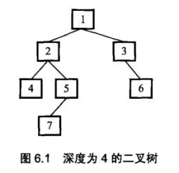

## 面试题39：二叉树的深度

题目一：输入一棵二叉树的根结点，求该树的深度。从根结点到叶子点依次经过的结点（含根、叶结点）形成树的一条路径，最长路径的长度为树的深度。

如果一棵树只有一个结点，它的深度为。 如果根结点只有左子树而没有右子树， 那么树的深度应该是其左子树的深度加1，同样如果根结点只有右子树而没有左子树，那么树的深度应该是其右子树的深度加1. 如果既有右子树又有左子树， 那该树的深度就是其左、右子树深度的较大值再加1 . 比如在图6.1 的二叉树中，根结点为1 的树有左右两个子树，其左右子树的根结点分别为结点2和3。根结点为2 的左子树的深度为3 ， 而根结点为3 的右子树的深度为2，因此根结点为1的树的深度就是4 。 
这个思路用递归的方法很容易实现， 只需要对遍历的代码稍作修改即可。




代码实现：
```java
    public int TreeDepth(TreeNode root) {
    if (root == null) {
        return 0;
    }
    int left = TreeDepth(root.left);
    int right = TreeDepth(root.right);
    return (left > right) ? (left + 1) : (right + 1);
}
```


题目二：输入一棵二叉树的根结点，判断该树是不是平衡二叉树。如果某二叉树中任意结点的左右子树的深度相差不超过1 ，那么它就是一棵平衡二叉树。

**解法一：需要重新遍历结点多次的解法** 
在遍历树的每个结点的时候，调用函数treeDepth得到它的左右子树的深度。如果每个结点的左右子树的深度相差都不超过1 ，按照定义它就是一棵平衡的二叉树。

代码实现：
```java
public boolean IsBanlced(TreeNode root) {
    if (root == null) {
        return true;
    }

    int left = TreeDepth(root.left);
    int right = TreeDepth(root.right);
    int diff = left - right;
    if (diff > 1 || diff < -1) {
        return false;
    }
    return IsBanlced(root.right) && IsBanlced(root.left);

}

public int TreeDepth(TreeNode root) {
    if (root == null) {
        return 0;
    }
    int left = TreeDepth(root.left);
    int right = TreeDepth(root.right);
    return (left > right) ? (left + 1) : (right + 1);
}

```

**解法二：每个结点只遍历一次的解法** 

用后序遍历的方式遍历二叉树的每一个结点，在遍历到一个结点之前我们就已经遍历了它的左右子树。只要在遍历每个结点的时候记录它的深度（某一结点的深度等于它到叶节点的路径的长度），我们就可以一边遍历一边判断每个结点是不是平衡的。

```java
public boolean isBalanced(TreeNode root){
    int depth = 0;
    return isBalanced(root,depth);
}
public boolean isBalanced(TreeNode root,int depth){
    if(root == null){
        depth = 0;
        return true;
    }
    int left = 0,right = 0;
    if(isBalanced(root.left,left) && isBalanced(root.right,right)){
        int diff = left-right;
        if(diff <= 1 && diff >= -1){
            depth = 1+(left > right?left : right);
            return true;
        }
    }
    return false;
}
```
