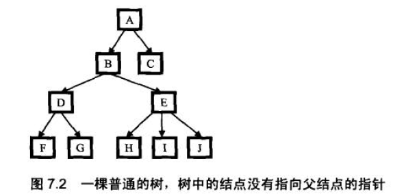

# 面试题50：树中两个结点的最低公共祖先

题目：求树中两个结点的最低公共祖先，此树不是二叉树，并且没有指向父节点的指针。

先忽略此树不是二叉树这个条件。

最低祖先不包括本身。

**情况一：该树是一颗二叉搜索树**


思路：从树的根节点开始遍历，如果根节点的值大于其中一个节点，小于另外一个节点，则根节点就是最低公共祖先。否则如果根节点的值小于两个节点的值，则递归求根节点的右子树，如果大于两个节点的值则递归求根的左子树。如果根节点正好是其中的一个节点，那么说明这两个节点在一条路径上，所以最低公共祖先则是根节点的父节点

实现代码：
```java
public TreeNode getLowCommonParent(TreeNode root, TreeNode p1, TreeNode p2) {
    return getLowCommonParent(null, root, p1, p2);
}

/**
 *
 * @param rootParent 当前根节点的父节点
 * @param root 根节点
 * @param p1 子孙节点
 * @param p2 子孙节点
 * @return
 */
private TreeNode getLowCommonParent(TreeNode rootParent, TreeNode root, TreeNode p1, TreeNode p2) {
    if (root == null || p1 == null || p2 == null) {
        return null;
    }

    int a = root.val - p1.val;
    int b = root.val - p2.val;

    if (a * b < 0) {
        return root;
    } else if (a > 0 && b > 0) {
        return getLowCommonParent(root,root.left, p1, p2);
    } else if (a < 0 && b < 0) {
        return getLowCommonParent(root,root.right, p1, p2);
    } else
        return rootParent;
}
```

测试代码：
```java
@Test
public void test() {
    TreeNode A = new TreeNode(4);
    TreeNode B = new TreeNode(2);
    TreeNode C = new TreeNode(6);
    TreeNode D = new TreeNode(1);
    TreeNode E = new TreeNode(3);
    TreeNode F = new TreeNode(5);
    TreeNode G = new TreeNode(7);
    A.left = B;
    A.right = C;
    B.left = D;
    B.right = E;
    C.left = F;
    C.right = G;
    TreeNode res1 = getLowCommonParent(A, E, F);
    TreeNode res2 = getLowCommonParent(A, D, E);
    TreeNode res3 = getLowCommonParent(A, B, D);
    System.out.println("The lowest common ancestor of 3 and 5 is " + res1.val);
    System.out.println("The lowest common ancestor of 1 and 3 is " + res2.val);
    System.out.println("The lowest common ancestor of 1 and 2 is " + res3.val);
}
```

result：
```
The lowest common ancestor of 3 and 5 is 4
The lowest common ancestor of 1 and 3 is 2
The lowest common ancestor of 1 and 2 is 2

```
复杂度:由于递归调用二叉树，所以时间复杂度是O(logn)，空间复杂度是O(1)


**情况二：树是普通的二叉树，且树中节点有指向父节点指针**
二叉树的结构：
```java
public class NewTreeNode {  
    public int value;  
    public NewTreeNode parentNode;  
    public NewTreeNode leftNode;  
    public NewTreeNode rightNode;  
      
    public NewTreeNode(int value){  
        this.value = value;  
        parentNode = null;  
        leftNode = null;  
        rightNode = null;  
    }  
}  
```


思路：两个节点如果在两条路径上，那么类似于“求两个链表的第一个公共节点”的算法题
 
```java
public NewTreeNode getLowCommonParent(NewTreeNode root, NewTreeNode p1, NewTreeNode p2) {
        if (root == null || p1 == null || p2 == null) {
            return null;
        }
        int depth1 = findTheDepthOfTheNode(root, p1, p2);
        if (depth1 == -1) {
            return p2.parentNode;
        }
        int depth2 = findTheDepthOfTheNode(root, p2, p1);
        if (depth2 == -1) {
            return p1.parentNode;
        }
        //p指向较深的节点q指向较浅的节点  
        NewTreeNode p = depth1 > depth2 ? p1 : p2;
        NewTreeNode q = depth1 > depth2 ? p2 : p1;
        int depth = Math.abs(depth1 - depth2);
        while (depth > 0) {
            p = p.parentNode;
            depth--;
        }
        while (p != q) {
            p = p.parentNode;
            q = q.parentNode;
        }
        return p;
    }

    //求p1的深度，如果p1和p2在一条路径上，则返回-1，否则返回p1的深度  
    public static int findTheDepthOfTheNode(NewTreeNode root, NewTreeNode p1, NewTreeNode p2) {
        int depth = 0;
        while (p1.parentNode != null) {
            p1 = p1.parentNode;
            depth++;
            if (p1 == p2) {
                return -1;
            }
        }
        return depth;
    }
```
复杂度：由于每个节点的深度最多为logn，所以时间复杂度为O(logn),空间复杂度O(1)


**情况三：树是普通的二叉树，节点没有指向父节点的指针**

思路：用栈来实现类似于指向父节点指针的功能

实现代码：
```java
public TreeNode getLowCommonParent(TreeNode root, TreeNode p1, TreeNode p2) {
    if(root == null || p1 == null || p2 == null){
        return null;
    }
    Stack<TreeNode> path1 = new Stack<TreeNode>();
    boolean flag1 = getThePathOfTheNode(root, p1,path1);
    if(!flag1){//树上没有p1节点  
        return null;
    }
    Stack<TreeNode> path2 = new Stack<TreeNode>();
    boolean flag2 = getThePathOfTheNode(root, p2,path2);
    if(!flag2){//树上没有p2节点  
        return null;
    }
    if(path1.size() > path2.size()){ //让两个路径等长  
        while(path1.size() !=  path2.size()){
            path1.pop();
        }
    }else{
        while(path1.size() !=  path2.size()){
            path2.pop();
        }
    }
    if(path1.equals(path2)){//当两个节点在一条路径上时  
        path1.pop();
        return path1.pop();
    }else{
        TreeNode p = path1.pop();
        TreeNode q = path2.pop();
        while(q != p){
            p = path1.pop();
            q = path2.pop();
        }
        return p;
    }
}

//获得根节点到node节点的路径  
public static boolean getThePathOfTheNode(TreeNode root,TreeNode node,Stack<TreeNode> path){
    path.push(root);
    if(root == node){
        return true;
    }
    boolean found = false;
    if(root.left != null){
        found = getThePathOfTheNode(root.left, node, path);
    }
    if(!found && root.right != null){
        found = getThePathOfTheNode(root.right, node, path);
    }
    if(!found){
        path.pop();
    }
    return found;
}
```
复杂度：获取node节点的路径时间复杂度为O(n),所以总的时间复制度是O(n),空间复杂度是O(logn)

**情况四：此树不是二叉树**
树的结构定义：

```java


private static class TreeNode {
    int val;

    List<TreeNode> children = new LinkedList<>();

    public TreeNode() {
    }

    public TreeNode(int val) {
        this.val = val;
    }
}
```
思路：


我们首先得到一条从根结点到树中某一结点的路径，这就要求在遍历的时候，有一个辅助内存来保存路径．比如我们用前序遍历的方法来得到从根结点到H 的路径的过程是这样的：（ 1 ）遍历到A，把A 存放到路径中去，路径中只有一个结点A; ( 2 ）遍历到B，把B 存到路径中去，此时路径为A->B; ( 3 ）遍历到D，把D 存放到路径中去，此，时路径为A->B->D; ( 4 ） ：遍历到F，把F 存放到路径中去，此时路径为A->B->D->F;( 5) F 已经没有子结点了，因此这条路径不可能到这结点H. 把F 从路径中删除，变成A->B->D; ( 6 ）遍历G. 和结点F 一样，这条路径也不能到达H. 边历完G 之后，路径仍然是A->B->D; ( 7 ）由于D 的所有子结点都遍历过了，不可能到这结点H，因此D 不在从A 到H 的路径中，把D 从路径中删除，变成A->B; ( 8 ）遥历E，把E 加入到路径中，此时路径变成A->B->E, ( 9 ）遍历H，已经到达目标给点， A->B->E 就是从根结点开始到达H 必须经过的路径。 

同样，我们也可以得到从根结点开始到达F 必须经过的路径是A->B功。接着，我们求出这两个路径的最后公共结点，也就是B. B这个结点也是F 和H 的最低公共祖先． 
　　

```java
/**
 * 找结点的路径
 *
 * @param root   根结点
 * @param target 目标结点
 * @param path   从根结点到目标结点的路径
 */
public static void getNodePath(TreeNode root, TreeNode target, List<TreeNode> path) {
    if (root == null) {
        return;
    }

    // 添加当前结点
    path.add(root);

    List<TreeNode> children = root.children;
    // 处理子结点
    for (TreeNode node : children) {

        if (node == target) {
            path.add(node);
            return;
        } else {
            getNodePath(node, target, path);
        }
    }

    // 现场还原
    path.remove(path.size() - 1);
}

/**
 * 找两个路径中的最后一个共同的结点
 *
 * @param p1 路径1
 * @param p2 路径2
 * @return 共同的结点，没有返回null
 */
public static TreeNode getLastCommonNode(List<TreeNode> p1, List<TreeNode> p2) {
    Iterator<TreeNode> ite1 = p1.iterator();
    Iterator<TreeNode> ite2 = p2.iterator();
    TreeNode last = null;

    while (ite1.hasNext() && ite2.hasNext()) {
        TreeNode tmp = ite1.next();
        if (tmp == ite2.next()) {
            last = tmp;
        }
    }

    return last;

}

/**
 * 找树中两个结点的最低公共祖先
 * @param root 树的根结点
 * @param p1 结点1
 * @param p2 结点2
 * @return 公共结点，没有返回null
 */
public static TreeNode getLastCommonParent(TreeNode root, TreeNode p1, TreeNode p2) {
    if (root == null || p1 == null || p2 == null) {
        return null;
    }
    List<TreeNode> path1 = new LinkedList<>();
    getNodePath(root, p1, path1);
    List<TreeNode> path2 = new LinkedList<>();
    getNodePath(root, p2, path2);

    return getLastCommonNode(path1, path2);
}
```

为了得到从根结点开始到输入的两个结点的两条路径，需要遍历两次树，每边历一次的时间复杂度是O(n）.得到的两条路径的长度在最差情况时是O(n)时，通常情况这两条路径的长度是O(logn).